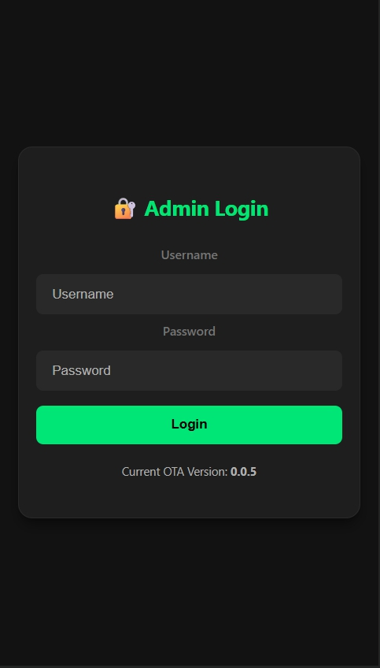
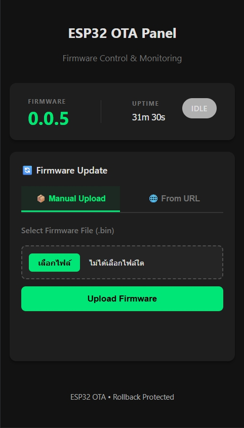

# ESP32 OTA Plug v0.1.0 🚀

A modern, secure, and beautiful Web OTA (Over-The-Air) firmware update solution for ESP32.

## ✨ Features (v0.1.0)

*   **🎨 Modern UI/UX**:
    *   Sleek Dark Theme with glassmorphism elements.
    *   Responsive design (Mobile & Desktop friendly).
    *   Smooth animations and transition effects.
    *   **Dashboard Grid** for quick status monitoring (Version, Uptime).
*   **🔒 Enhanced Security**:
    *   **Secure Login System**: specific UI for authentication.
    *   Protected API Endpoints (`/update`, `/status`, `/ota-progress`).
    *   Auto-logout on unauthorized access.
*   **⚡ Smart Interactions**:
    *   **Real-time Progress Bar**: Visual feedback during upload.
    *   **UI Lock-out**: Prevents user interference during the update process.
    *   **Input Validation**: Checks file types (.bin) and sizes before upload.
*   **🛠️ Developer Friendly**:
    *   **One-Line Setup**: `ota.begin(VERSION)` handles SPIFFS and Server startup automatically.
    *   Easy integration with existing ESP32 projects.
    *   Configuration via `ESP32WebOTAConfig.h`.

## 📦 Improvements in v0.1.0

This release introduces major API simplifications and stability improvements:

1.  **Simplified API**: New `ota.begin("VERSION")` handles SPIFFS mounting and Web Server startup automatically.
2.  **Robust Versioning**: Firmware version is now mandatory in `begin()`, ensuring consistency between Source and NVR.
3.  **Dashboard Grid**: Enhanced status dashboard layout for professional monitoring.
4.  **Layout Stability**: Fixed layout shifts in tabbed interfaces.

## 🚀 Getting Started

1.  **Dependencies**: Ensure your `platformio.ini` is set up for ESP32.
2.  **Upload Filesystem**: You **MUST** upload the files in `data/` to SPIFFS/LittleFS for the web UI to work.
    ```bash
    pio run --target uploadfs
    ```
3.  **Include & Initialize**:
    ```cpp
    #include <ESP32WebOTA.h>
    
    AsyncWebServer server(80);

    void setup() {
      Serial.begin(115200);
      
      // 1. Setup WiFi
      WiFi.begin("SSID", "PASSWORD");
      while (WiFi.status() != WL_CONNECTED) delay(500);

      // 2. Initialize OTA 
      // This automatically mounts SPIFFS, sets version, and starts the Server.
      static ESP32WebOTA ota(server);
      ota.begin("0.1.0"); 
    }

    void loop() {
      // No ota.handle() required!
    }
    ```

## 📸 Screenshots

<!-- 

 -->
<p align="center">
  
   
   
</p>

## 📄 License

MIT License
