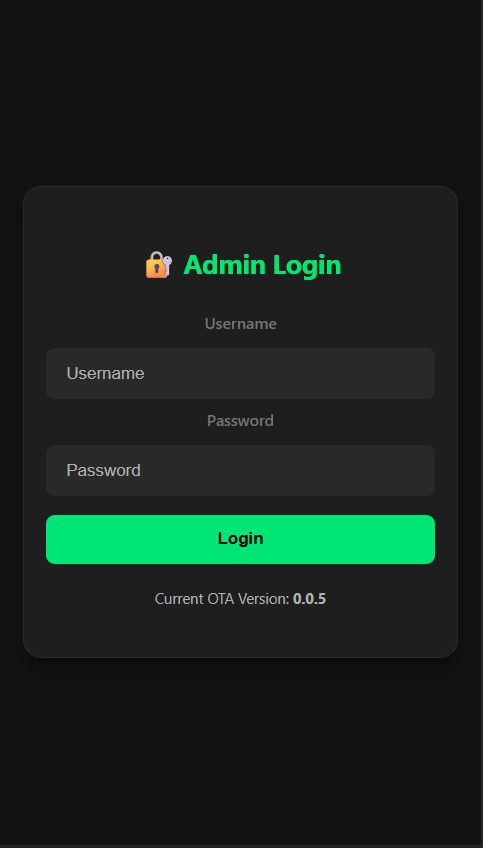
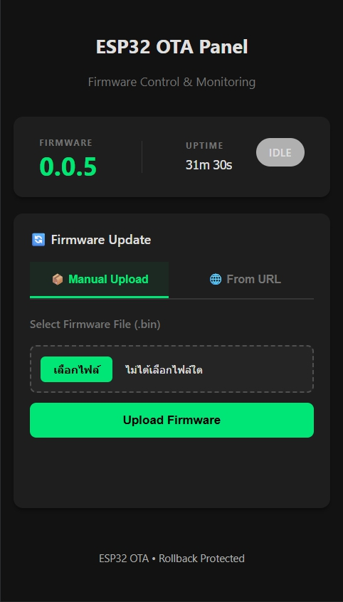
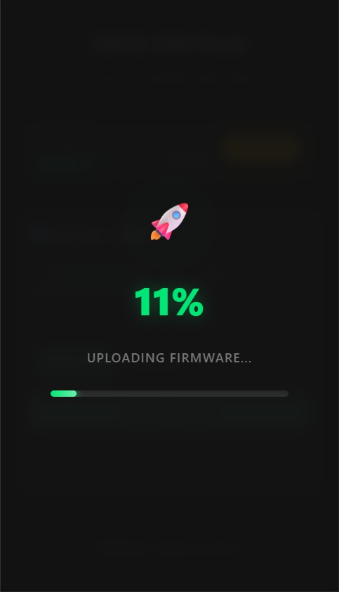

# ESP32 OTA Plug v0.1.0 🚀

A modern, secure, and beautiful Web OTA (Over-The-Air) firmware update solution for ESP32.

## ✨ Features (v0.1.0)

*   **🎨 Modern UI/UX**:
    *   Sleek Dark Theme with glassmorphism elements.
    *   Responsive design (Mobile & Desktop friendly).
    *   Smooth animations and transition effects.
    *   **Dashboard Grid** for quick status monitoring (Version, Uptime).
*   **📡 Smart Wi-Fi Manager**:
    *   **Auto-Connect**: Tries to connect to saved network on boot.
    *   **SoftAP Fallback**: Creates a Hotspot (`ESP32-Config`) if connection fails.
    *   **Captive Portal**: Redirects users to configuration page automatically.
    *   **Scan & Connect**: Beautiful UI to search and select networks.
*   **🔒 Enhanced Security**:
    *   **Secure Login System**: specific UI for authentication.
    *   Protected API Endpoints (`/update`, `/status`, `/ota-progress`).
    *   Auto-logout on unauthorized access.
*   **⚡ Smart Interactions**:
    *   **Real-time Progress Bar**: Visual feedback during upload.
    *   **UI Lock-out**: Prevents user interference during the update process.
    *   **Input Validation**: Checks file types (.bin) and sizes before upload.
*   **🛠️ Developer Friendly**:
    *   **One-Line Setup**: `ota.begin(VERSION)` handles SPIFFS and Server startup.
    *   Easy integration with existing ESP32 projects.

## 📦 Improvements in v0.1.0

This release introduces major API simplifications and stability improvements:

1.  **Simplified API**: New `ota.begin("VERSION")` handles SPIFFS mounting and Web Server startup automatically.
2.  **WiFi Manager**: Built-in SoftAP and Captive Portal for easy network configuration.
3.  **Robust Versioning**: Firmware version is now mandatory in `begin()`, ensuring consistency.
4.  **Dashboard Grid**: Enhanced status dashboard layout for professional monitoring.

## 🚀 Getting Started

1.  **Dependencies**: Ensure your `platformio.ini` is set up for ESP32.
2.  **Upload Filesystem**: You **MUST** upload the files in `data/` to SPIFFS/LittleFS.
    ```bash
    pio run --target uploadfs
    ```
3.  **Include & Initialize**:
    ```cpp
    #include <ESP32WebOTA.h>
    #include <ESP32WebWiFi.h>
    
    AsyncWebServer server(80);
    DNSServer dns;
    
    ESP32WebWiFi wifi(server, dns);
    ESP32WebOTA ota(server);

    void setup() {
      Serial.begin(115200);
      
      // 1. Initialize WiFi (Connect or AP Mode)
      wifi.begin(); 

      // 2. Initialize OTA (Auto starts server)
      ota.begin("0.1.0"); 
    }

    void loop() {
      wifi.loop(); // Handle Captive Portal DNS
    }
    ```

## 📸 Screenshots

<p align="center">
  
  
  
</p>

## 📄 License

MIT License
